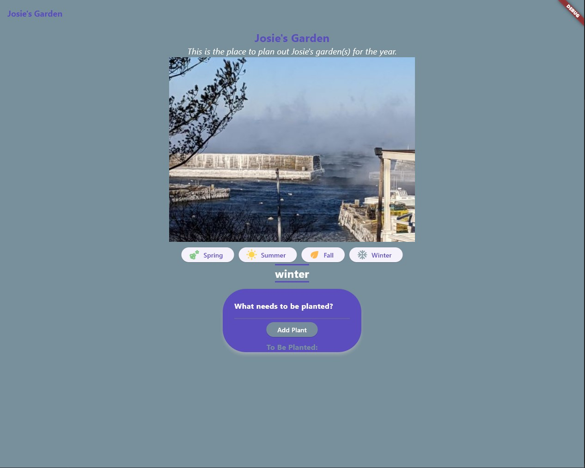

# Garden App
The Garden App is a mobile application built with Flutter that helps users plan and organize their garden activities throughout the year. Adapted from the Garden webpage. Features and content are still being added

## Features
- Switch between seasons and manage your plant lists accordingly.
- Add New Plants: Easily add new plants to your garden for each season, and saves list for each user.
- The app's theme changes based on the selected season, providing a visually appealing experience.
- The user interface is designed to be intuitive and easy to navigate.

## Installation
- Clone this repository to your local machine.
- Ensure you have Flutter installed. If not, follow the official Flutter installation guide.
- Open the project in your preferred IDE.
- Run the app on your chosen connected device using `flutter run`.

## Screenshots

